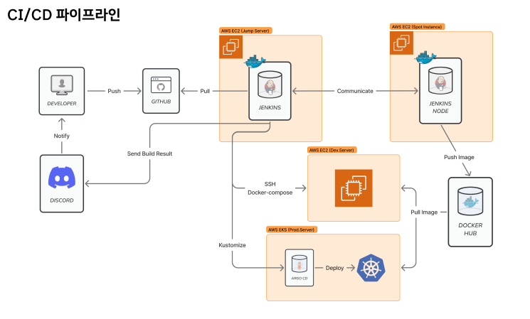

# WithYou

[](https://github.com/your-username/withyou-server)
[](https://opensource.org/licenses/MIT)

**WithYou**는 여행의 추억을 공유하고 소통하는 소셜 미디어 플랫폼의 백엔드 API입니다. 이 프로젝트는 Spring Boot를 기반으로 구축되었으며, 사용자 인증, 게시물 관리, 클라우드 연동 등 다양한 기능을 제공합니다.

## ✨ 주요 기능

- **사용자 관리:** 회원가입, 로그인, 소셜 로그인 (OAuth 2.0)
- **인증/인가:** JWT (JSON Web Token) 기반의 안전한 인증 시스템
- **게시물 관리:** 여행기, 사진 등 게시물 CRUD
- **소셜 기능:** 댓글, 좋아요, 팔로우
- **클라우드 연동:** AWS S3를 이용한 미디어 파일 업로드 및 관리
- **API 문서:** Swagger (Springdoc OpenAPI)를 통한 API 명세 자동화

## 🛠️ 기술 스택

### Backend
<p>
  
  
  
  
  
  
</p>

### Authentication
<p>
  
  
</p>

### CI/CD
<p>
  
  
</p>

### Build & Dependency
<p>
  
</p>

### Test
<p>
  
  
</p>


## 🏛️ 아키텍처

### 서비스 아키텍처


### CI/CD 파이프라인



## 📁 디렉토리 구조
```
.
├── src
│   ├── main
│   │   ├── java
│   │   │   └── UMC
│   │   │       └── WithYou
│   │   │           ├── WithYouApplication.java
│   │   │           ├── common      # 공통 모듈 (API 응답, 예외 처리, 설정)
│   │   │           ├── feature     # 도메인별 비즈니스 로직
│   │   │           │   ├── auth
│   │   │           │   ├── member
│   │   │           │   ├── post
│   │   │           │   └── ...
│   │   │           ├── infra       # 외부 시스템 연동 (AWS S3)
│   │   │           └── support     # 인증 필터, Argument Resolver
│   │   └── resources
│   │       └── application.yml
│   └── test
│       └── java
└── build.gradle
```